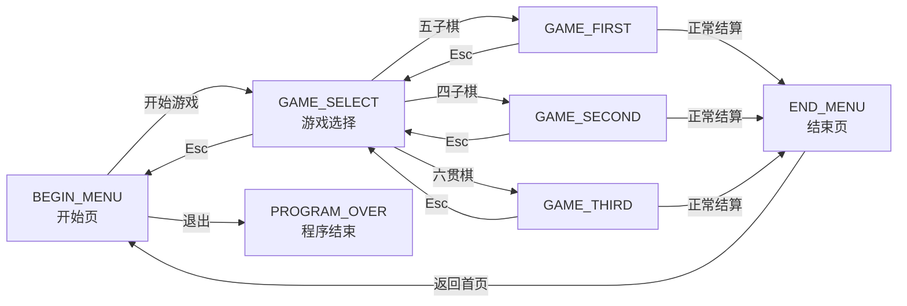

# EasyX Game Launcher

<p align="center">
  <strong>基于 C++ 与 EasyX 实现的本地双人棋类小游戏合集</strong><br>
  从页面状态管理、键盘交互到棋盘胜负算法，完整展示一个 Windows 图形小游戏项目的核心实现。
</p>

## 项目简介

EasyX Game Launcher 是一个运行于 Windows 的棋类游戏启动器，当前集成了 **五子棋、四子棋和六贯棋** 三款游戏。两名玩家可以共用一套键盘进行回合制对战，程序提供开始菜单、游戏选择、对局、胜负结算和返回首页等完整流程。

这个仓库以源码展示和 C++ 图形编程学习为主，不提供预编译可执行文件。当前源码版本标识为 **v1.7**。

## 已实现游戏

| 游戏 | 棋盘 | 核心规则 | 选择页星级 |
| --- | --- | --- | :---: |
| 五子棋 | 15 × 15 | 横、竖或斜线方向率先连成至少 5 枚同色棋子的一方获胜 | ★★★☆☆ |
| 四子棋 | 6 × 7 | 棋子受重力落入所选列，率先在任意方向连成至少 4 枚的一方获胜 | ★★☆☆☆ |
| 六贯棋 | 11 × 11 六角网格 | 蓝方连接上下边、粉方连接左右边，率先贯通己方两侧边界的一方获胜 | ★★★★☆ |

> 选择页中的星级仅用于展示游戏上手难度，不会改变规则或对局强度；历史界面还保留了两张“敬请期待”占位卡片，对应功能并未实现，也不再计划开发。

## 功能特点

- **本地双人对战**：两名玩家共用键盘，蓝方先手，按回合交替落子。
- **统一页面流程**：通过 `GameState` 枚举组织开始页、选择页、三款游戏和结束页之间的跳转。
- **独立规则实现**：三款游戏使用各自的棋盘模型、坐标映射和胜负判定逻辑。
- **图形与动画**：基于 EasyX 绘制界面，使用双缓冲减少闪烁，并为四子棋实现逐帧下落动画。
- **多媒体反馈**：包含背景图片、按钮点击、棋子落下和游戏结束音效。
- **输入环境处理**：启动时保存当前键盘布局并切换到英文输入，退出时恢复原布局。

## 操作说明

### 对局按键

| 游戏 | 蓝方操作 | 粉方操作 |
| --- | --- | --- |
| 五子棋 | `W` `A` `S` `D` 移动，`F` 落子 | 方向键移动，`Enter` 落子 |
| 四子棋 | `A` `D` 选择列，`F` 投放 | `←` `→` 选择列，`Enter` 投放 |
| 六贯棋 | `W` `A` `S` `D` 移动，`F` 落子 | 方向键移动，`Enter` 落子 |

### 通用操作

- 使用鼠标点击开始页按钮和游戏选择卡片。
- 在游戏选择页按 `Esc` 返回开始页。
- 对局中按 `Esc` 放弃当前对局并返回游戏选择页。
- 对局结束后按 `V` 关闭结算提示并进入结束页。
- 在开始页点击“退出”按钮正常关闭程序。

## 运行流程



程序入口在 `0_Main.cpp`。完成 EasyX 窗口、资源、双缓冲和输入法初始化后，主循环根据当前 `GameState` 调用对应页面；每个页面的事件处理函数再返回下一个状态，从而完成页面导航。

## 核心实现

### 1. 棋盘模型与方向扫描

五子棋和四子棋均使用 `vector<vector<int>>` 保存棋盘状态：`0` 表示空位，`1` 和 `2` 分别表示两名玩家。落子后从目标棋子向水平、垂直及两条对角线的正反方向扫描：

```text
同色连线长度 = 当前棋子 + 正方向连续棋子数 + 反方向连续棋子数
```

当连线长度达到对应阈值时即判定获胜；棋盘填满且无人获胜时判定和棋。

### 2. 四子棋重力落子

玩家确认列后，程序自底向上查找该列第一个空位。动画阶段按固定像素步长更新棋子纵坐标，并持续重绘背景、棋盘和已有棋子；棋子到达目标位置后才将结果写入逻辑棋盘。

### 3. 六贯棋连通性动态规划

六贯棋将胜负问题转换为六角网格上的边到边可达性：

- 蓝方从棋盘上边界出发，逐行传播可达状态，检查能否连接到底边。
- 粉方从棋盘左边界出发，逐列传播可达状态，检查能否连接到右边。
- 每轮落子后分别执行上下与左右方向的连通性检测。

### 4. EasyX 事件与绘制

项目通过 `ExMessage` 和 `peekmessage` 处理鼠标、键盘事件，使用 `BeginBatchDraw`、`FlushBatchDraw` 完成批量绘制。`Button` 与 `Level` 类进一步封装了按钮/卡片绘制、点击区域判断和音效播放。

## 项目结构

```text
EasyX Game Launcher/
├─ README.md
├─ LICENSE
├─ 林和光_开发日志 v1.7.txt   # 项目版本迭代记录
└─ Project File/
   ├─ 0_Main.cpp              # 程序入口、初始化与页面状态机
   ├─ 1_BeginMenu.cpp         # 开始菜单
   ├─ 2_GameSelect.cpp        # 游戏选择页
   ├─ 3_GameFirst.cpp         # 五子棋
   ├─ 4_GameSecond.cpp        # 四子棋
   ├─ 5_GameThird.cpp         # 六贯棋
   ├─ 99_EndMenu.cpp          # 对局结束页
   ├─ 100_FuncRealize.cpp     # 公共颜色与背景绘制函数
   ├─ Button.h / Button.cpp   # 通用按钮组件
   ├─ Level.h / Level.cpp     # 游戏选择卡片组件
   ├─ InputMethod.cpp         # 输入法保存、切换与恢复
   ├─ GameBasic.h             # 公共声明、常量与状态枚举
   ├─ 林和光_EasyX 学习版.sln
   ├─ 林和光_EasyX 学习版.vcxproj
   └─ asset/
      ├─ image/               # 背景与开始页主题图片
      └─ sound/               # 点击、落子与结算音效
```

项目从 v1.0 的基础菜单与五子棋逐步迭代，先后加入四子棋、六贯棋、UI 优化、规则说明、输入法切换和页面返回功能。详细过程参见 [v1.7 开发日志](./林和光_开发日志%20v1.7.txt)。

## 构建与运行

### 环境要求

- Windows
- Visual Studio 2022，安装“使用 C++ 的桌面开发”工作负载
- MSVC v143 工具集
- Windows 10 SDK
- [EasyX](https://easyx.cn/) 图形库

项目工程提供 `Debug` / `Release` 与 `x86` / `x64` 配置。

### 运行步骤

1. 克隆或下载本仓库。
2. 安装 Visual Studio 2022 和 EasyX，并确保当前 Visual Studio 环境能够找到 `easyx.h` 及 EasyX 链接库。
3. 打开 `Project File/林和光_EasyX 学习版.sln`。
4. 选择需要的生成配置和目标平台，然后生成解决方案。
5. 使用 Visual Studio 启动调试或直接运行程序。

### 资源路径说明

图片和音频通过 `asset\...` 相对路径加载，未嵌入可执行文件。运行时应将工作目录设置为 `Project File`：

```text
项目属性 → 配置属性 → 调试 → 工作目录 → $(ProjectDir)
```

如果界面背景或音效未正常加载，请优先检查工作目录以及 `Project File/asset` 是否完整。部分源码包含本地代码页中文文本，建议保留工程现有字符集和文件编码，避免批量转换后出现乱码。

## 技术要点

- C++ 二维动态数组与棋盘数据建模
- 页面级有限状态机与模块化源文件组织
- EasyX 图形绘制、双缓冲和消息处理
- 键盘/鼠标交互及同机双人按键映射
- 横、竖、双对角线方向连线检测
- 六角网格坐标映射与连通性动态规划
- 基于重绘的棋子下落动画
- WinMM 音效播放与 Windows 输入法布局管理

## 项目状态与功能边界

这是一个已经停止维护的早期 C++ / EasyX 练手项目。仓库目前仅作为个人学习记录和源码展示保留，不再计划新增功能或发布后续版本。

## License

本项目基于 [MIT License](./LICENSE) 开源。

Copyright © 2025 林和光
